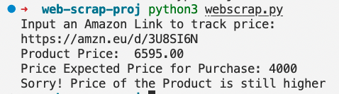

# Steps to Use the code

```
Author: Chirag Ganguli
Last Modified: 03 Oct, 2022
```

**Product URL used in this example:** amazon.in/Fossil-Mens-Chronograph-Grant-Sport/dp/B01M72HDL7/ref=sr_1_14?pf_rd_i=2563504031&pf_rd_m=A1VBAL9TL5WCBF&pf_rd_p=6d8d824a-1076-417c-bbaf-81e410678bb4&pf_rd_r=4PTZ366TJJVKF9F854CC&pf_rd_s=merchandised-search-5&qid=1664805457&refinements=p_n_feature_fourteen_browse-bin%3A11142592031%2Cp_89%3AFossil%2Cp_n_pct-off-with-tax%3A30-&rnid=3837712031&s=watches&sr=1-14

Press the 'Share' Icon next to product and 'Copy Link'.

Paste the Link after executing the Python Code

> Output (Results)


